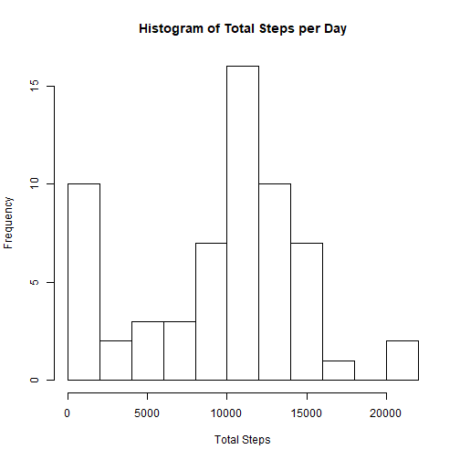
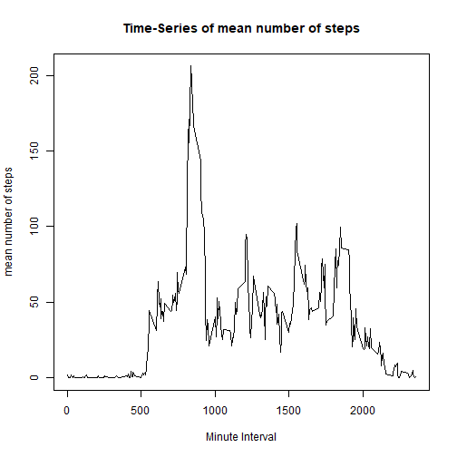
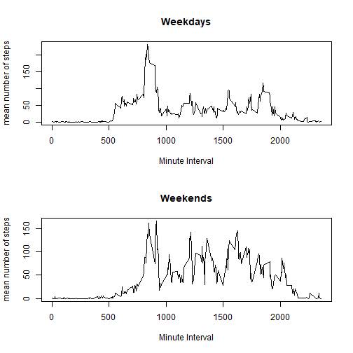

## Loading and Preprocessing the data


```r
dataraw <- read.csv("activity.csv", header=TRUE)
library(dplyr)
```

## Mean Steps per day

What is mean total number of steps taken per day?


```r
totalsteps <- aggregate(dataraw$steps, by=list(date=dataraw$date), FUN=sum, na.rm=TRUE)
colnames(totalsteps) <- c("date", "steps")
hist(totalsteps$steps, main="Histogram of Total Steps per Day", xlab="Total Steps", breaks=10)
```



```r
mean<-mean(totalsteps$steps, na.rm=TRUE)
median<-median(totalsteps$steps, na.rm=TRUE)
paste("The mean total steps in a day is", mean, "and the median is", median, ".")
```

```
## [1] "The mean total steps in a day is 9354.22950819672 and the median is 10395 ."
```

## Average Daily Activity Pattern
Which 5 minute interval contains the maximum number of steps?


```r
totalinterval <- aggregate(dataraw$steps, by=list(interval=dataraw$interval), FUN=mean, na.rm=TRUE)
colnames(totalinterval) <- c("interval", "steps")
with(totalinterval, plot(interval, steps, xlab="Minute Interval", ylab = "mean number of steps", main = "Time-Series of mean number of steps",type = "l"))
```



```r
row<- totalinterval[which.max(totalinterval$steps),]
paste("The interval with the largest average number of steps is interval", row$interval, ".")
```

```
## [1] "The interval with the largest average number of steps is interval 835 ."
```

## Number of Missing Values
Note that there are a number of days/intervals where there are missing values (coded as NA). The presence of missing days may introduce bias into some calculations or summaries of the data.
How many missing values are there?

```r
sum(!complete.cases(dataraw[]))
```

```
## [1] 2304
```


## New Data Frame
Creating a new data frame using mean value for that interval

```r
newdata <- dataraw %>%
  right_join(totalinterval, by = c("interval")) %>%
  mutate(steps = ifelse(is.na(steps.x), steps.y, steps.x)) %>%
  select(-c(steps.x, steps.y))
```


### New Mean Steps Per Day

```r
newtotalsteps <- aggregate(newdata$steps, by=list(date=newdata$date), FUN=sum, na.rm=TRUE)
colnames(newtotalsteps) <- c("date", "steps")
hist(newtotalsteps$steps, main="Histogram of Total Steps per Day", xlab="Total Steps", breaks=10)
```


```r
newmean<-mean(newtotalsteps$steps, na.rm=TRUE)
newmedian<-median(newtotalsteps$steps, na.rm=TRUE)
paste("The new mean total steps in a day is", newmean, "and the median is", newmedian, ", instead of", mean, "and", median, "respectively.")
```

```
## [1] "The new mean total steps in a day is 10766.1886792453 and the median is 10766.1886792453 , instead of 9354.22950819672 and 10395 respectively."
```
Both the mean and the median have increased value, but they are now identical estimates.


## Weekdays and Weekends

```r
newdata$date<-as.Date(newdata$date, format = "%Y-%m-%d")
newdata$daytype<-weekdays(newdata$date)
weekdays <- subset(newdata, daytype == "Monday" | daytype == "Tuesday" | daytype == "Wednesday" | daytype == "Thursday" | daytype == "Friday")
weekends <-subset(newdata, daytype == "Saturday" | daytype == "Sunday")

weekdayinterval <- aggregate(weekdays$steps, by=list(interval=weekdays$interval), FUN=mean, na.rm=TRUE)
colnames(weekdayinterval) <- c("interval", "steps")
weekendinterval <- aggregate(weekends$steps, by=list(interval=weekends$interval), FUN=mean, na.rm=TRUE)
colnames(weekendinterval) <- c("interval", "steps")
par(mfrow = c(2,1))
with(weekdayinterval, plot(interval, steps, xlab="Minute Interval", ylab = "mean number of steps", main = "Weekdays",type = "l"))
with(weekendinterval, plot(interval, steps, xlab="Minute Interval", ylab = "mean number of steps", main = "Weekends",type = "l"))
```




